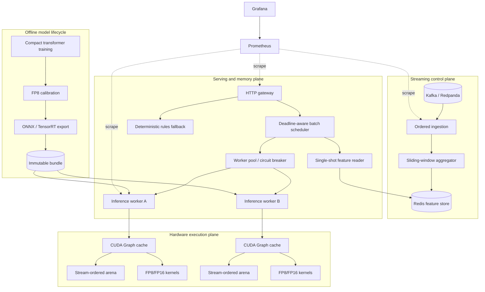

# Container architecture

## Responsibility boundaries

| Plane | Owns | Must not do |
| --- | --- | --- |
| Training | fit, calibrate, validate, sign/export | mutate a live worker model in place |
| Execution | buffers, kernels, graph replay, capability choice | fetch remote features |
| Serving | authentication, deadlines, batching, routing, fallback | calculate historical windows on request |
| Streaming | ordering, deduplication, windows, materialization | synchronously block an authorization |
| Infrastructure | placement, rollout, telemetry, secret references | embed credentials in images or manifests |

