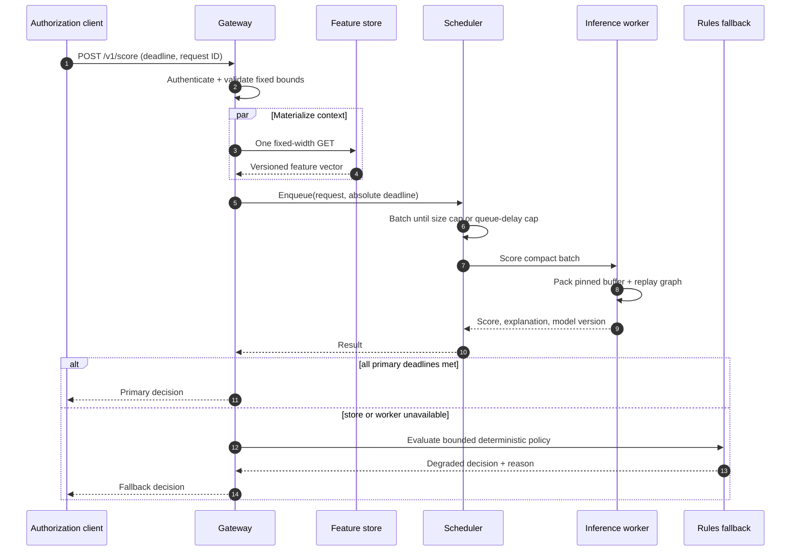

# Hot-path sequence and latency budget

## Default target budget

The numbers below are configuration targets for a co-located, warmed deployment;
they are not benchmark claims. Tests verify deadline behavior, while the profiling
harness records observed values.

| Phase | p95 target | Enforcement |
| --- | ---: | --- |
| Parse, authenticate, validate | 75 us | bounded payload and constant-time token comparison |
| Feature lookup | 200 us | one key, child deadline, no online aggregation |
| Scheduler queue | 100 us | strict queue-delay cap and caller deadline |
| Worker dispatch + inference | 350 us | persistent connection and graph replay |
| Encode and return | 75 us | fixed response schema |
| Contingency | 200 us | absorbs jitter; activates fallback at deadline |
| Total | 1,000 us | absolute request deadline |

Every metric is emitted separately so a fast kernel cannot hide a slow network or
queue. Cold starts, cross-region calls, cache misses, and fallback responses are
reported as distinct populations.

