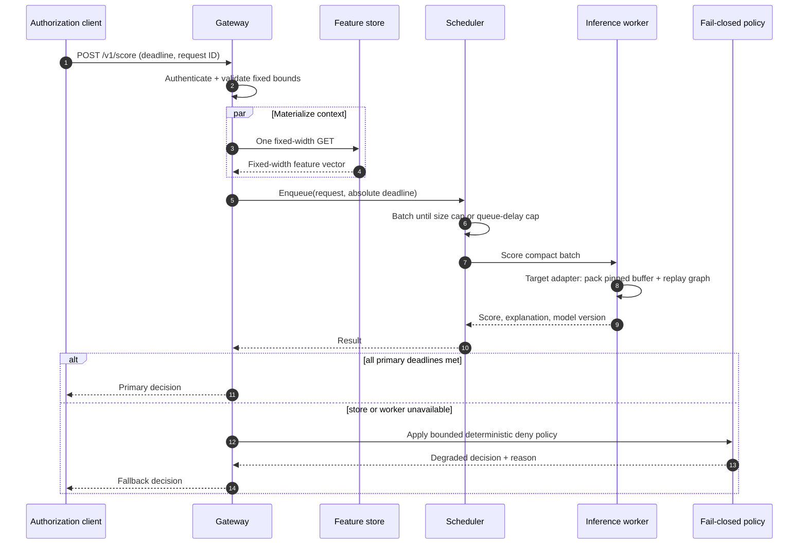

# Target hot-path sequence and latency budget

This sequence is the production destination. The executable Go worker currently
uses a deterministic CPU scorer, while CUDA Graph replay and the exported-model
adapter remain explicit milestones in
[`implementation_status.md`](implementation_status.md).

## Default target budget

The numbers below are a prospective SLO budget for a co-located, warmed
deployment; they are not the relaxed local defaults and are not benchmark claims.
Tests verify deadline behavior, while the profiling protocol defines how observed
values must be recorded.

| Phase | p95 target | Enforcement |
| --- | ---: | --- |
| Parse, authenticate, validate | 75 us | bounded payload and constant-time token comparison |
| Feature lookup | 200 us | one key, child deadline, no online aggregation |
| Scheduler queue | 100 us | strict queue-delay cap and caller deadline |
| Worker dispatch + inference | 350 us | persistent connection and graph replay |
| Encode and return | 75 us | fixed response schema |
| Contingency | 200 us | absorbs jitter; activates fallback at deadline |
| Total | 1,000 us | absolute request deadline |

Production profiling must measure each phase separately so a fast kernel cannot
hide a slow network or queue. The baseline exports total request, scheduler, and
worker histograms; per-phase feature/dispatch histograms remain instrumentation
work. Cold starts, cross-region calls, cache misses, and fallback responses must
be reported as distinct populations.
