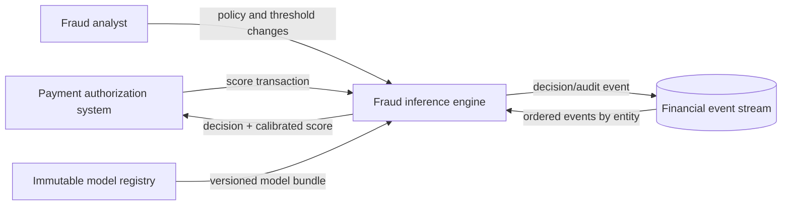

# System context

The fraud inference engine turns an authorized transaction request into an allow,
review, or decline recommendation. Its sub-millisecond objective applies to the
warm scoring path inside one region; event ingestion, model training, deployment,
and replay are explicitly outside that latency boundary.

## Scope and guarantees

- Ordering is guaranteed per chosen entity key, not globally.
- The synchronous path performs one fixed-width feature lookup and one worker
  dispatch at most.
- Every internal operation receives a deadline no later than the caller's.
- A timeout or unhealthy worker activates a deterministic, auditable fallback.
- Native FP8 is selected only when the compiled backend and device capability
  support it; FP16 and CPU reference paths remain available.
- Scores and explanations identify the exact model, calibration, and policy
  versions that produced them.

The project does not promise universal sub-millisecond latency. It supplies the
instrumentation and benchmark protocol needed to demonstrate that property on a
named hardware, network, data, and load configuration.

