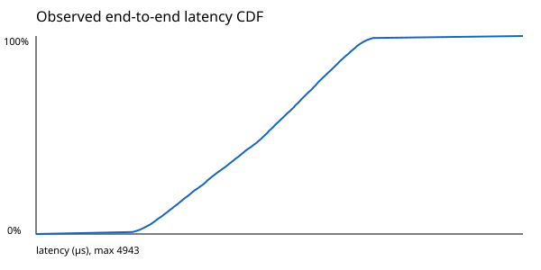
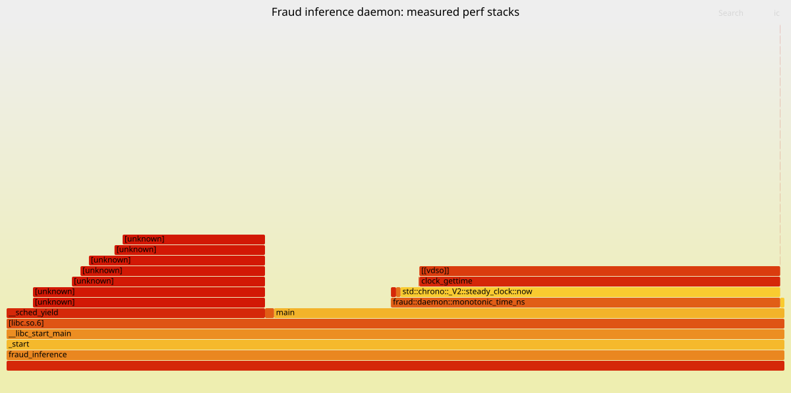

# Profiling protocol

No performance number belongs in this repository without the command, commit,
hardware, software versions, load shape, and raw artifact that produced it.

## Three latency scopes

1. **Kernel latency**: CUDA events around an individual kernel, after warmup.
2. **GPU interval latency**: packing through graph completion, including copies.
3. **API decision latency**: client send through response receipt, split into
   parsing, feature lookup, queueing, worker, and response phases.

Report p50, p95, p99, p99.9, maximum, throughput, error rate, and fallback rate.
Keep cold and warm runs separate. Use a fixed seed and archive the exact request
corpus or its generator configuration.

## Curated measured run: `d71b52f`, Actions `30587168363`

This manually triggered run exercised the real Rust HTTP gateway, System V
shared-memory ring, and C++ daemon on a four-logical-CPU GitHub-hosted Azure
runner using an AMD EPYC 7763 processor. This revision performed parser-enabled
FlatBuffers verification of the `FRTX` identifier and transaction structure in
the daemon. The daemon was compiled with frame pointers, but CUDA Graph
initialization was unavailable, so it used the **CPU reference handler**. These
measurements are therefore CPU-path reproducibility evidence, not GPU evidence
or a production SLO claim.

The Go client scheduled 15,000 transaction requests with a seeded open-loop
Poisson process (mean 1,500 arrivals/s, seed `20260730`, concurrency limit 128).
Latency begins at each planned arrival and ends after the HTTP response, so it
includes client-side admission delay. All 15,000 requests completed with HTTP
`200`; there were zero non-2xx responses and zero transport errors.

| Observation | Measured value |
|---|---:|
| Elapsed | 9.962161655 s |
| Throughput | 1,505.6973094259633 responses/s |
| p25 | 1,695 us |
| p50 | 2,325 us |
| p75 | 2,837 us |
| p90 | 3,145 us |
| p95 | 3,261 us |
| p99 | 3,421 us |
| p99.9 | 3,939 us |
| Maximum | 4,943 us |

Durable evidence:

- [Result and workload manifest](results/d71b52f-run-30587168363-result.json)
- [Latency CDF](results/d71b52f-run-30587168363-latency-cdf.svg) and [percentile CSV](results/d71b52f-run-30587168363-distribution.csv)
- [Daemon flame graph](results/d71b52f-run-30587168363-flamegraph.svg) and [folded perf stacks](results/d71b52f-run-30587168363-perf-folded.txt)
- [Perf diagnostics](results/d71b52f-run-30587168363-perf-diagnostics.txt) and [hardware/tool provenance](results/d71b52f-run-30587168363-provenance.txt)
- [GitHub Actions run 30587168363](https://github.com/pranavkkp4/Distributed-Fraud-Detection/actions/runs/30587168363), commit `d71b52fd17c8e500d2a67901031081fc492e6917`

### Observed HTTP latency CDF



### C++ daemon CPU flame graph



`perf` captured 4,988 records at 499 Hz over ten seconds after
`perf_event_paranoid` was changed from 4 to 1. Kernel symbols remained
restricted (`kptr_restrict=1`), and frame-pointer unwinding contains unknown
frames. Brendan Gregg's renderer labels accumulated perf period weights as
"samples" in the SVG, so those large labels are not literal event counts. The
graph samples only the C++ daemon and is dominated by its polling/clock/yield
loop; it excludes Rust gateway and Go client CPU work. It is a CPU-time profile,
not latency attribution, allocation tracing, or proof of a completely
allocation-free hot path.

## Curated local CUDA evidence: `2627824c`

Five RTX 3050 processes measured 100 warmups followed by 2,000 batch-32
observations per mode. The median run summaries were direct p50/p99
40.4/58.1 us and CUDA Graph replay p50/p99 40.5/59.5 us. For this tiny forward
stub, graph replay did not improve either percentile. Scope and environment are
recorded in the [direct manifest](results/cuda_direct_2627824.json),
[graph manifest](results/cuda_graph_replay_2627824.json), and
[five-run CSV](results/cuda_component_runs_2627824.csv).

The [raw Nsight Systems report](results/fraud_cuda_2627824.nsys-rep),
[machine-readable summary](results/nsys_summary_2627824.json), and
[timeline intervals](results/nsys_timeline_2627824.csv) retain the measured CUDA
API/device evidence. The trace found the bounded host-preparation interval inside
the graph interval in all 500 probes and asynchronous H2D API return before copy
completion in 2,093 of 2,100 joined calls. This is a small mechanics result, not
an end-to-end speedup. [Compute Sanitizer](results/compute_sanitizer_2627824.txt)
reported an exact CUTLASS INT8/CPU oracle match and zero errors. Nsight Compute
hardware counters were denied under `ERR_NVGPUCTRPERM`; the
[permission record](results/ncu_counter_permission_2627824.txt) is retained
instead of inventing occupancy or Tensor Core measurements.

## Kernel workflow

```text
ncu --set full --import-source yes --target-processes all \
  --export docs/profiling/results/<commit>-<gpu>-kernel \
  <execution-engine-benchmark>
```

Capture achieved occupancy, tensor-core utilization, DRAM bytes, L2 hit rate,
register pressure, shared-memory use, and dominant warp stall reasons. Compare the
FP32 reference, vendor FP16/FP8 path, and custom path on identical shapes.

## End-to-end workflow

Warm the feature keys and graph variants before measurement. Drive a documented
arrival distribution rather than only closed-loop maximum throughput. Record
queue-delay caps and repeat with a worker removed and Redis delayed. Use
`benchmark_manifest.example.json` as the machine-readable record.
